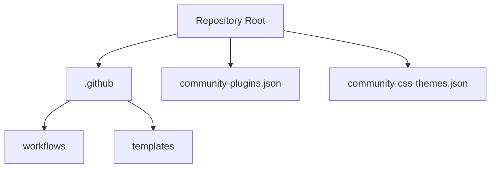
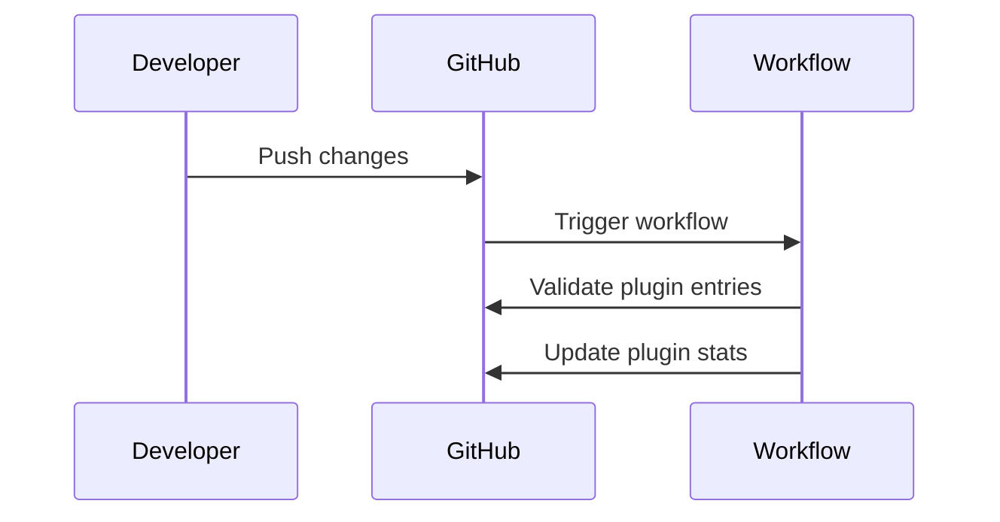
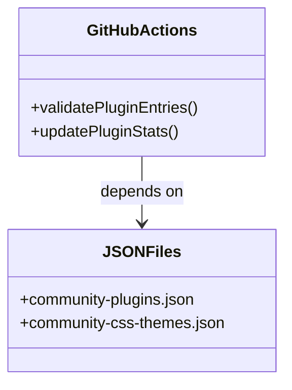

# New Developer Repository Ramp-Up Guide

## Overview and Purpose
This repository is used for hosting public releases of Obsidian, as well as community plugins and themes directories. The main objective is to provide a platform for developers to share their plugins and themes with the Obsidian community.

## Requirements and Dependencies
- Node.js
- npm
- Git
- A code editor like Visual Studio Code

## Installation and Setup Procedures
1. Install Node.js and npm from the official website.
2. Install Git from the official website.
3. Clone the repository using Git.
4. Navigate to the repository directory.
5. Run `npm install` to install the necessary dependencies.

## Code Structure and Organization
- The repository contains various JSON files for managing plugins, themes, and releases.
- GitHub workflows are used for automation.
- The `.github` directory contains templates and workflows.
- The `community-plugins.json` and `community-css-themes.json` files list the available plugins and themes.

## Key Functions, Classes, and Variables
- The repository primarily uses JSON files to manage plugins, themes, and releases.
- GitHub Actions workflows automate tasks like validating plugin entries and updating plugin stats.

## Interoperable Interdependencies
- GitHub Actions workflows depend on the JSON files for plugin and theme information.
- The `community-plugins.json` and `community-css-themes.json` files are used to list and manage plugins and themes.

## Best Practices and Coding Standards
- Follow the guidelines provided in the `README.md` for submitting plugins and themes.
- Adhere to the developer policies mentioned in the `README.md`.

## Potential Pitfalls and Areas to Be Mindful Of
- Ensure that the JSON files are correctly formatted to avoid errors in the GitHub Actions workflows.
- Regularly update the JSON files to keep the repository up-to-date.

## Action Plans and To-Do Lists for Learning and Development
- Familiarize yourself with the structure and organization of the repository.
- Learn how to create and submit plugins and themes.
- Explore the GitHub Actions workflows and understand how they automate tasks.

## Guidance on Development and Management Processes
- Use GitHub Actions workflows for automation.
- Follow the submission guidelines for plugins and themes.
- Regularly update the JSON files to keep the repository up-to-date.

## Extensibility and Modularity
- Add new plugins and themes by updating the respective JSON files.
- Create new GitHub Actions workflows for additional automation tasks.
- Ensure that the repository structure remains organized and easy to navigate.

## Additional Resources
- [Obsidian Developer Documentation](https://docs.obsidian.md)
- [Obsidian Community](https://obsidian.md/community)

## Visual Aids
### Code Structure and Organization

### GitHub Actions Workflow

### Interoperable Interdependencies

